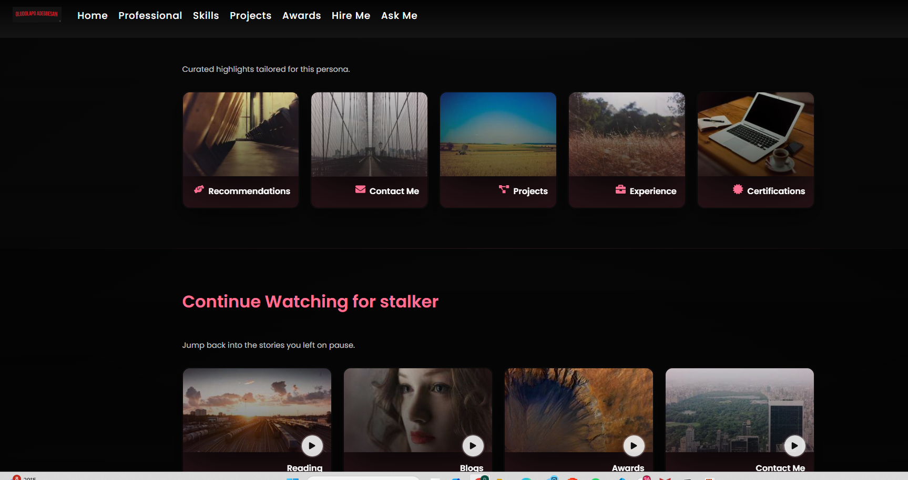
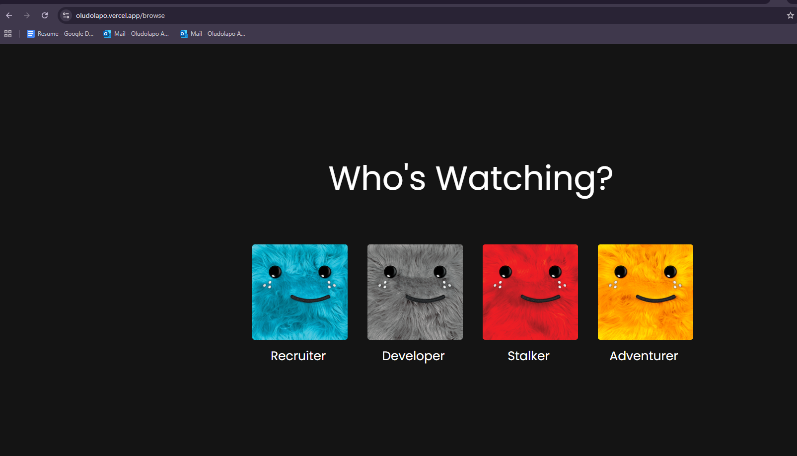
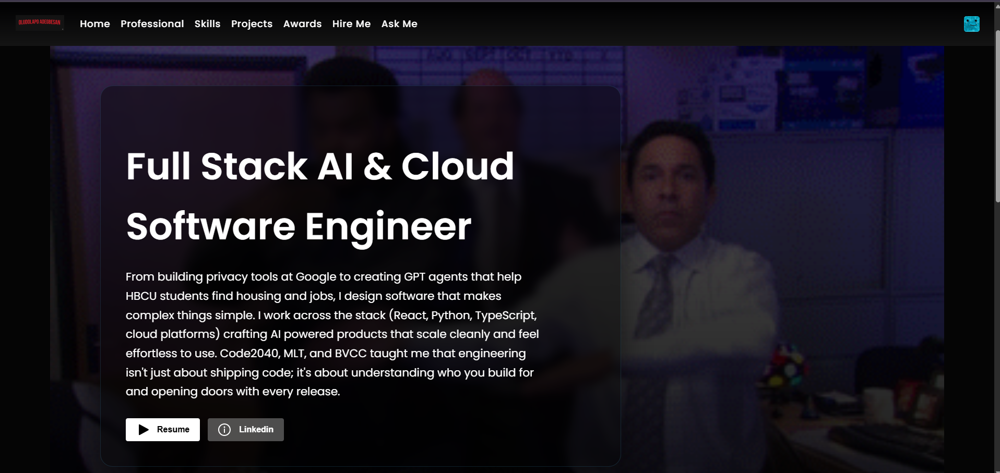
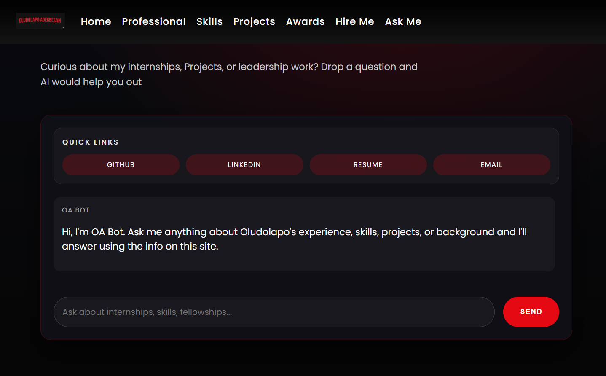

# Netflix-Inspired Portfolio

This repository powers my personal website, a Netflix-inspired experience that turns my resume into something you can actually binge. Visitors land on the familiar Netflix sting, pick a persona tile, and then explore rows of projects, fellowships, awards, playlists, and reading lists. All of the copy, media, and AMA context can be refreshed from Supabase and live GitHub data so the site stays current without a redeploy.



## Experience Overview
- **Cinematic intro -> persona gate.** One click triggers the Netflix audio sting and fans out persona tiles. Each persona injects its own GIF background so every visitor gets a bespoke home screen.
- **Profile rows like a streaming app.** The hero banner links to my resume and LinkedIn, and Top Picks / Continue Watching rows surface curated sections depending on the selected persona.
- **Deep-dive sections for every audience.** Dedicated routes walk through work experience, skills, projects, awards, certifications, recommendations, music, reading, blogs, and work permits using the same responsive layout.
- **Ask Me Anything powered by Gemini.** OA Bot reads Supabase data about my experience and streams conversational markdown answers so people can chat instead of scrolling forever.
- **Live GitHub + Supabase content.** Spotlight cards hydrate with README summaries and cover art from GitHub, while Supabase tables keep the timeline, skills, and contact info editable without code changes.

## Screenshots

_Netflix-style persona gate that sets the tone and swaps background GIFs once a visitor chooses who they are._


_Recruiter persona home screen with the hero banner, resume + LinkedIn CTAs, and the navbar that unlocks deeper routes._


_Gemini-backed AMA panel answering questions with live context from Supabase so visitors can chat about my story._

## Highlights
- **Intro + persona gate** with custom audio, animated GIF avatars, and router state to theme the profile page.
- **Supabase-powered content** for timeline, skills, projects, recommendations, contact, etc., with graceful fallbacks while you seed tables.
- **Ask Me Anything (OA Bot)** streams site context into Gemini and renders markdown replies so visitors can chat about Dolapo's story.
- **Responsive Netflix UI** with shared navbar/sidebar, section cards, GitHub repo feed, playlists, reading list, and downloadable recommendation letters.

## Tech Stack
- React 18 + TypeScript (Create React App)
- React Router 6
- Supabase JS SDK
- @google/generative-ai + markdown-to-jsx
- Custom CSS + react-icons

## Structure
```
src/
+-- App.tsx             # route map
+-- NetflixTitle.tsx    # intro animation + sound
+-- browse/             # persona selector grid
+-- components/         # NavBar, ProfileCard, buttons.
+-- pages/              # WorkExperience, Skills, Projects, AskMeAnything, etc.
+-- profilePage/        # banner + personalized rows
+-- queries/            # Supabase helpers
+-- lib/askGemini.ts    # Gemini wrapper
```

## Local Setup
```bash
git clone <repo>
cd netflix_portfolio
nvm install 18
nvm use 18
npm install
```
Create `.env` (or `.env.local`) with:
```
REACT_APP_SUPABASE_URL=https://<project>.supabase.co
REACT_APP_SUPABASE_ANON_KEY=<anon key>
REACT_APP_GEMINI_API_KEY=<browser-safe key>
REACT_APP_GITHUB_TOKEN=<optional PAT for higher GitHub limits>
```
Then run `npm start` and open http://localhost:3000.

## Scripts
- `npm start` - CRA dev server
- `npm run build` - optimized bundle in `build/`
- `npm test` - CRA Jest suite

## Deployment (Vercel)
1. In Project -> Settings -> Environment Variables add:
   - `REACT_APP_SUPABASE_URL`
   - `REACT_APP_SUPABASE_ANON_KEY`
   - `REACT_APP_GEMINI_API_KEY`
   - `REACT_APP_GITHUB_TOKEN`
2. Build command: `npm run build`
3. Output directory: `build`
4. Deploy via dashboard or `vercel --prod`.

## Sample Supabase Schema
```sql
create table if not exists profile_banner (
  id uuid primary key default gen_random_uuid(),
  background_url text,
  headline text,
  resume_url text,
  linkedin_url text,
  profile_summary text
);

create table if not exists skills (
  id uuid primary key default gen_random_uuid(),
  name text,
  category text,
  description text,
  icon text
);

create table if not exists timeline_items (
  id uuid primary key default gen_random_uuid(),
  timeline_type text,
  name text,
  title text,
  tech_stack text,
  summary_points text[],
  date_range text,
  sort_order int
);
```
Add tables for projects, contact, certifications, awards, etc. The UI automatically falls back to bundled sample data while you seed Supabase.

## Contributing
PRs are welcome for UI polish, accessibility, new personas, or deeper data/AI integrations. Please open an issue for larger features.

---
MIT License
